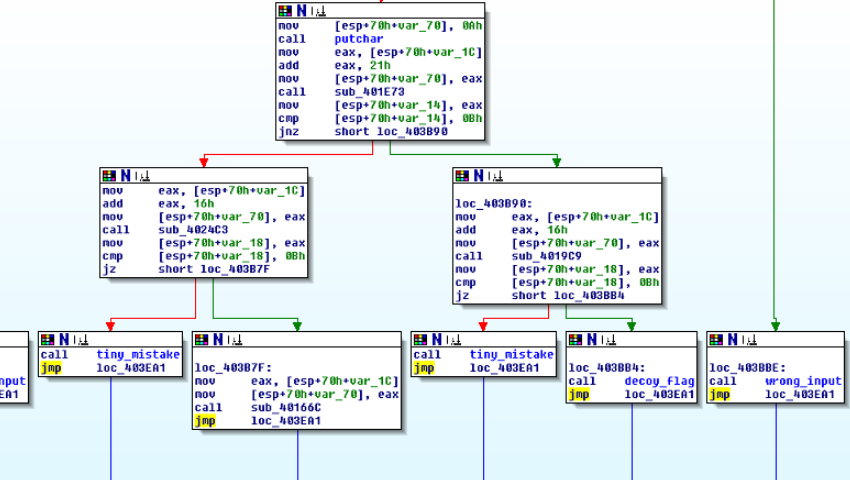

# Decoy writeup InCTF
The file given is a Pe32 executable. So we will work in Ida Pro Free on windows XP. Yay...

Loading the file into Ida gives us som good stuff directly:


Following the string and xrefing it back we get to what looks like a printflag function. Looks like something interesting happens here. 


By simply changing the program counter I try to go there. Aaaaaand it's a trap.


We back up one more step in the program to try getting a picture of how stuff works. And yes, as seen by the xrefs we can get here in many ways (very, very many ways). This is totally a decoy.


Okey, this is a big tree... Lets atleast start by marking the function we came from. 


By looking at where the leafs of the tree we see that almost everyone leads to the functions I named "decoy_flag", "wrong_input" and "tiny_mistake".



But there is one that goes somewhere else. So this is probably where we want to go.

# More debugging!
Let's try to walk through the execution.

We start by setting a breakpoint at the first compare in the tree. And it directly takes us in the wrong direction. Lets just set it to go the other way. We still havent input anything so lets just hope that it doesnt change the output. 


We step our way until we get to the fgets call, then types the alphabet or whatever you like in to the terminal. Preferably some sequence that you can recognize later on. After the fgets the program tests that the string is longer than 16h(22). 

After this we come to the function sub4018D9, this is the first encryption function. The function takes the 11th until 22nd index of the string and throws it through the following steps. The most interesting thing is the xor. The function xor every character in the string with "0xB" and with "0x13"


After the xor is done the program does a comparison with the following string 
```
(mv|GLp+Gv+
```


We do xor on the string to get the reverse of the encrypted version. And we actually get something that looks like it could be a part of the key.


Now we can replace the part of the string with our decrypted string to verify that it is correctly deciphered.

We continue through the tree. and get to decipher function 2.

The function snips the string into two parts. and then it add 4 to the ascii value of one part and 2 to the other part. Then compares the output against the stored string. 
```
}[2waHmrgxj
```


After encryption-function 2 there is a debugchecker so we have to look out for that. 

In function 3 the encrypted string is loaded in char by char to make it harder to find, but if we follow the debugger doing it, it's easy to find it. 


The encryption function for this one is simple, only that it is a bit obfuscated. edx is the letter in the string and it is added with eax.


## Now for the last one!

The last function loads in the encrypted string much alike the last function but it has zeroes between each letter. 


This gives the string 
```
n]9Uf9pA}
```
On the first iteration of the xor var_8 is 1. The program xor the input on the last index and then compares with the last index in the encrypted string. If they are the same the program steps one step backwards in the string. But this time it xors with the previous result. When it has xored the value it compares the character with the encrypted string. So now we know how the function encrypts the string.


By running the encyption algorithm backwards we get the decrypted string.


If we put it all together we get "inctf{Y0u_F0und_Th3_n33dl3_In_Th|z_H4y$t4cK}". And there you have your flag.