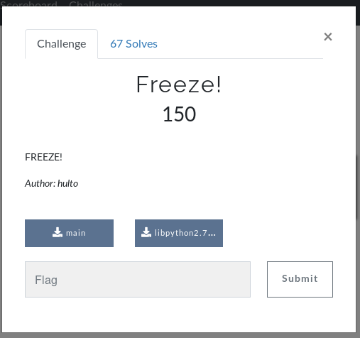
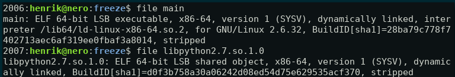
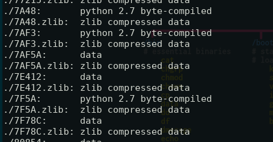
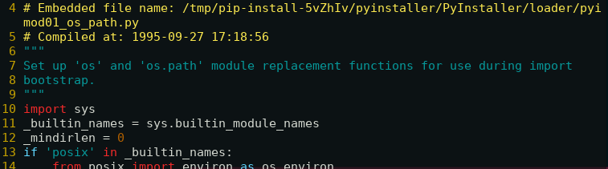
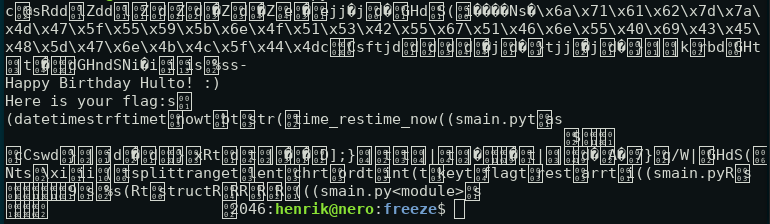
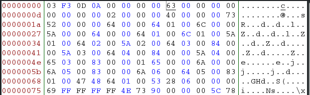
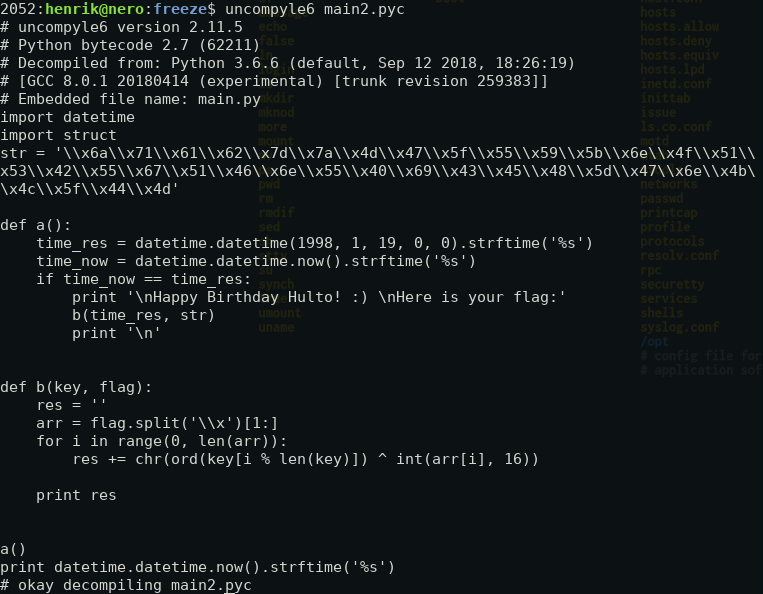
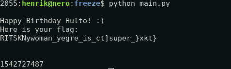
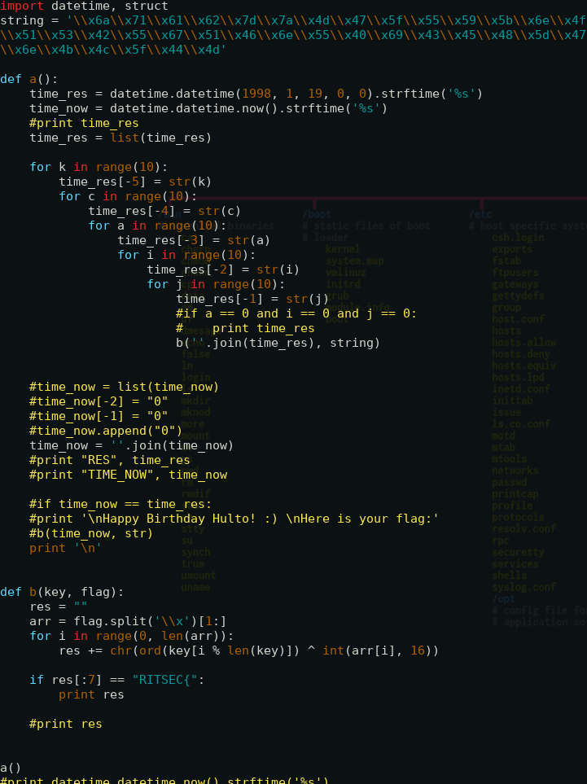
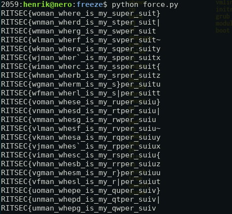

# Freeze writeup RITSEC
This challenge was solved with @ludvigknutsmark

In this challenge we are supplied with the two files:
* main
* libpython2.7.so.1.0

Doing file on the executables gives us the following:

The fact that the program uses a python-library is a strong indication that the program is some kind of compiled python program. Let's further investigate.

By using binwalk on main we get a bunch of zlib-compressed data-files. Let's extract those and see if there is anything interesting here. 

Testing file on all the files in the folder we see that there are som python 2.7 byte-compiled files.

Using uncompyle6 to decompile the bytecode-files we can read the python-scripts. The scripts didnt really hold any interesting information except for the filenames.

So now we know that it is installed using PyInstaller. 

After a good hour sifting through google I found out that PyInstaller for Linux has a built-in tool called "pyi-archie_viewer"

Getting closer, but the file we get is labeled as data. The file is a .pyc file but we need to fix the header.
With a little help from https://www.fortinet.com/blog/threat-research/python-based-malware-uses-nsa-exploit-to-propagate-monero--xmr--.html the header of the file was fixed. 

When the bytecode is stored inside the executable the header is removed for some reason. The header is the byte-sequence \x03\xF3\x0D\x0A followed by a 4 byte timestamp. So we insert \x03\xF3\x0D\x0A\x00\x00\x00\x00 at the beginning of the file using bless.

After this is done we can decompile the .pyc file. 

If we just change the if statement in the file we should get the flag.

Okey, so this was wierd... After we solved the challenge an announcement came up telling that there could be problems solving the challenge if you weren't in America. Luckily one of my teammates figured out that we could probably bruteforce it as it looks like the problem could only be because of some time-issue. 

Using the fact that we know the flag will start with "RITSEC{" we try by changing the last 5 numbers in the key and then print the decrypted message only if it contains RITSEC{. 

This is the output of the script, with the correct flag at the top!

