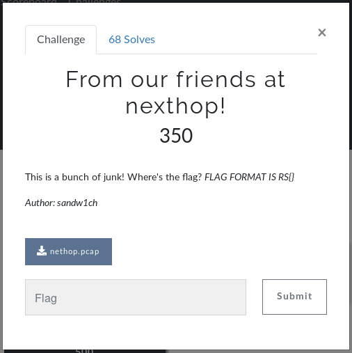
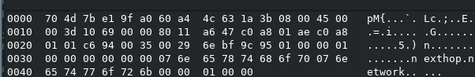
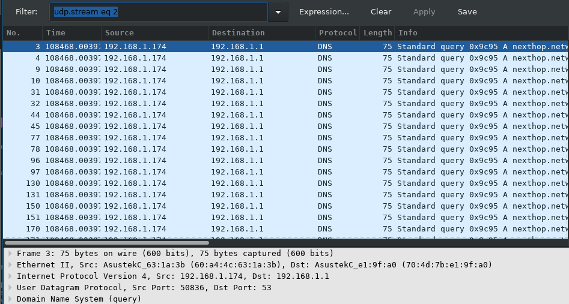
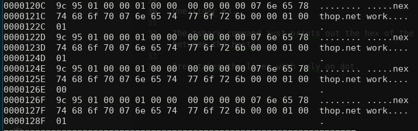
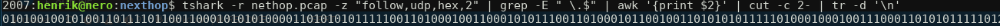

# From our friends at nexthop! 
## Forensics challenge at RITSEC



I start by checking the pcap in Wireshark because I think it has a okey GUI and it gives an idea of what im looking for.

This is the third packet looks interesting, nexthop.network in it, DNS. good stuff.


Lets follow this stream and see if there is something interesting.



For some reason the host on 192.168.174 has done very many dns queries to 192.168.1.1 and under a very short period of time. This is pretty suspicious. 

By looking at the hex output of the package we see that the class attribute of the message is flipping between 0 and 1 with some kind of pattern. This looks a bit like ascii-code. Also there happens to be exactly 144 packets(18*8). If we manually take out the first 4 words we get the following:
```
01010010 = R
01010011 = S
01111011 = {
00110001 = 1
```
"FLAG FORMAT IS RS{}" - This looks promising :)

Let's script out the rest of the conversation so that we only get the binary string we want.
```
tshark -r nethop.pcap -z "follow,udp,hex,2" |  grep -E " \.$" | awk '{print $2}' | cut -c 2- | tr -d '\n'
```
Mmmm one-liner <3.

The tshark command just prints out the hex of the conversation between the hosts.
As a nice coincidence the intersting line is all by itself. So using the the grep command to catch the the regex " \.$" should suffice to remove all unneeded rows.



After this its pretty straightforward what the command does. 

The final output:



If we convert the message to ascii we get the flag "RS{1T5_4LW4Y5_DN5}", neat!

